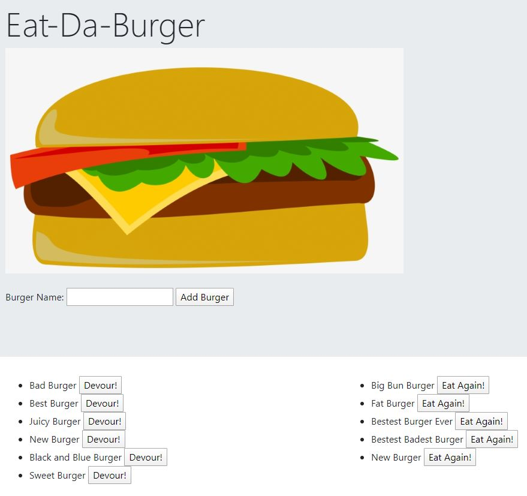

# Burger

This application uses Express, Node, Handlebars, and MySQL. Upon arriving to the landing page a user is able to type in a burger name of their choice. Once they have typed in the name and hit "add buger" the burger will then appear below their input on the left. Alongside the burger name is a button that says "Devour!" When clicked, the burger goes to the right side of the page and displays a button "Eat Again!". The Eat Again button will take the burger back to being able to be devoured. 

NPM installs required: 

* Express
* Express-Handlebars
* MySQL

This application is live on Heroku for viewing at this link:

